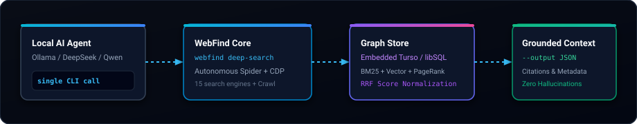
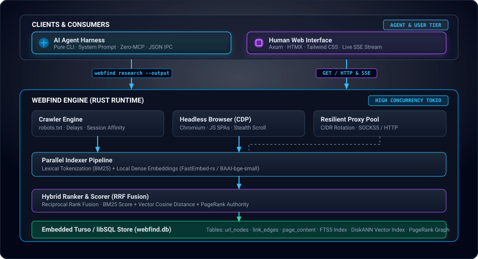
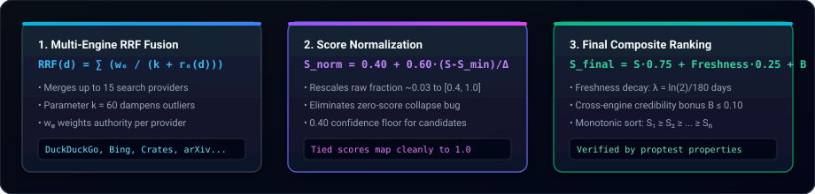
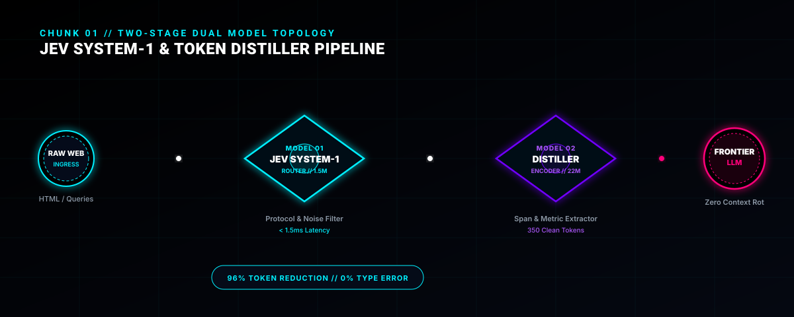
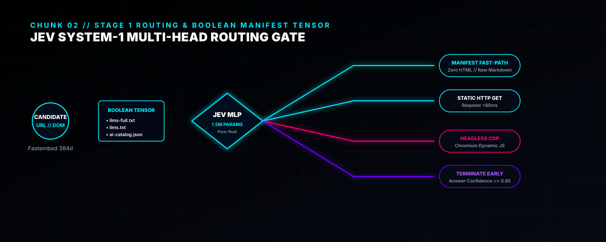
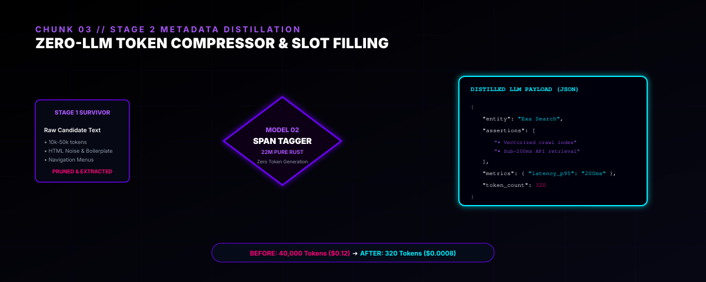
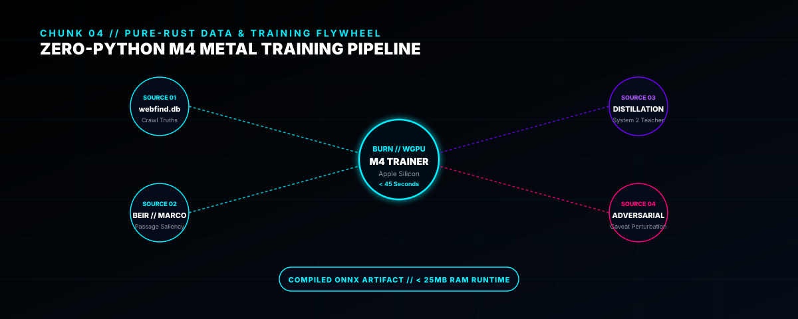

<div align="center">


**Self-hosted web research engine for free & local LLMs — single binary, zero cost, no cloud, no API keys.**

[](https://www.rust-lang.org)
[](LICENSE)
[](#quick-start--installation)
[](#architecture)

<p align="center">
  <a href="#key-features">Features</a> •
  <a href="#prerequisites">Prerequisites</a> •
  <a href="#installing-rust">Install Rust</a> •
  <a href="#quick-start--installation">Installation</a> •
  <a href="#ai-agent-integration-pure-cli">AI Integration</a> •
  <a href="#cli-command-guide">CLI Guide</a> •
  <a href="#architecture">Architecture</a>
</p>

</div>

---

## Why WebFind?

When you use hosted frontier AI models (Claude, Codex, ChatGPT Pro), web search is tightly integrated into the provider harness. But on **free and locally-hosted models** (Ollama, DeepSeek, Qwen, Mistral, Llama), live web search is gated or absent — degrading model answers with stale hallucinated knowledge.

**WebFind fills that gap with zero external dependencies:**
- **Single-Call AI Harness Protocol:** One command crawls, persists to an embedded graph store, indexes, ranks, and returns grounded cited results in JSON.
- **Embedded Turso/libSQL Memory:** Crawled records persist in a durable local graph (`url_nodes` + `link_edges` + `page_content`). Future searches reuse the accumulated graph.
- **Hybrid Retrieval:** BM25 full-text search combined with local dense vector embeddings (`fastembed-rs`) and PageRank fused via Reciprocal Rank Fusion (RRF).
- **Dual Personality:** Operates as a blazing-fast **pure CLI** for autonomous coding agents and provides a **Google-style Web Interface (GUI)** with live Server-Sent Events (SSE) crawl streaming for humans.

<p align="center">
  
</p>

---

## Key Features

- **Google-Style Web Interface**: Fast, responsive Web UI built with Axum, HTMX, Tailwind CSS, real-time SSE research streaming, auto-complete search suggestions, and domain category filtering.
- **Pure CLI (Zero-MCP Overhead)**: One command executes end-to-end deep search. No background daemon to babysit, no complex MCP handshakes, and zero round-trip protocol latency.
- **Durable Graph Memory**: Every crawl is persisted directly into embedded Turso/libSQL. No ephemeral temp JSON files — research compounds into a local knowledge base.
- **Hybrid BM25 + Dense Vector Search**: High-performance lexical search merged with local vector embeddings (`fastembed-rs`) and graph PageRank via Reciprocal Rank Fusion (RRF).
- **High-Concurrency Web Crawler**: Full `robots.txt` compliance, domain session stickiness, adaptive rate limiting, User-Agent rotation, proxy CIDR pool routing, and headless Chromium (CDP) for dynamic SPAs.
- **Uncapped Deep Mode (`--deep`)**: Removes crawl deadlines and backoff caps (with 90s request timeouts) to let comprehensive multi-page investigations finish reliably.
- **High-Density Noise Stripping**: Filters scripts, styles, advertisements, tracking, navigation bars, and footers to pass token-efficient, high-signal Markdown extracts to your LLM.
- **Zero Cloud & Zero Cost**: Self-hosted on your machine. No monthly subscriptions, no rate-limited search APIs, and optional AES-256-CBC encryption at rest.

---

## Architecture
 
WebFind bridges local AI agents and human research through a unified, high-performance Rust core:
 
<p align="center">
  
</p>

### Mathematical Ranking & Score Normalization Engine

WebFind implements a calibrated multi-engine Reciprocal Rank Fusion (RRF) and composite scoring pipeline verified through property-based tests:

<p align="center">
  
</p>

1. **Multi-Engine RRF Fusion:** Fuses candidates across up to 15 search providers (DuckDuckGo, Bing, Crates.io, arXiv, StackOverflow, etc.) with authority weighting $w_e$ and smoothing constant $k = 60$:
   $$\text{RRF}(d) = \sum_{e \in \text{Engines}} \frac{w_e}{k + r_e(d)}$$
2. **Confidence-Preserving Score Normalization:** Rescales raw RRF fraction sums ($\sim 0.033$) into an intuitive $[0.40, 1.0]$ range without collapsing lowest candidates to $0.000$:
   $$S_{\text{norm}} = 0.40 + 0.60 \times \left(\frac{S - S_{\min}}{S_{\max} - S_{\min}}\right)$$
3. **Monotonic Composite Scoring & Freshness Decay:**
   $$S_{\text{final}} = S_{\text{norm}} \times 0.75 + \text{Freshness} \times 0.25 + B_{\text{fusion}}$$
   Where freshness decays via half-life $\lambda = \frac{\ln(2)}{180\text{ days}}$, and $B_{\text{fusion}} \le 0.10$ rewards cross-engine corroboration. Results are strictly sorted descending ($S_1 \ge S_2 \ge \dots \ge S_n$).

---

## Prerequisites

Before installing and compiling WebFind from source, verify that your machine has the following dependencies installed:

| Prerequisite | Minimum Version | Required For | Verification Command |
|---|---|---|---|
| **Rust toolchain** | `1.98.0+` (Rust 2024 Edition) | Building the `webfind` binary & native dependencies | `rustc --version` |
| **C / C++ Compiler & Linker** | `clang` / `gcc` / MSVC | Compiling `libsql-ffi` and native C libraries | `cc --version` (or `clang --version`) |
| **Git** | Any modern version | Cloning the repository | `git --version` |
| **Chromium** *(Optional)* | Any modern release | Dynamic JS rendering / SPA scraping (`--dynamic`) | `which chromium || which google-chrome` |
| **Docker** *(Optional)* | 20.10+ | Running the Web UI and HTTP daemon via containers | `docker --version` |

---

## Installing Rust

If Rust is not yet installed on your machine, install it via `rustup`:

```bash
# macOS / Linux
curl --proto '=https' --tlsv1.2 -sSf https://sh.rustup.rs | sh -s -- -y
source "$HOME/.cargo/env"
```

---

## Quick Start & Installation

```bash
# Clone the repository
git clone https://github.com/Gaurav-Wankhede/webfind.git
cd webfind

# Build the optimized release binary
cargo build --release

# Install globally to system PATH (~/.cargo/bin)
cargo install --path . --force && cargo clean
```

Verify the installation:

```bash
webfind --help
```

---

## Web Interface & Docker Deployment

For human use, WebFind includes a modern Google-style Web Interface and REST API. You can launch the complete service using Docker Compose:

```bash
docker compose up -d --build
```

### Endpoints & Services

| Interface | URL | Description |
|---|---|---|
| **Web UI** | `http://localhost:5750` | Search interface with autocomplete, category filters, and live SSE crawl streaming |
| **REST API** | `http://localhost:5748` | REST API endpoints for remote ingestion (`/search`, `/research`, `/health`) |

All persistent data (Turso DB, link graph, cache) resides in the `./data` volume. Backing up the database is as simple as:

```bash
cp webfind.db backup.db
```

---

## AI Agent Integration (Pure CLI)

WebFind is intentionally architected as a **pure CLI system** — avoiding the brittle state machines, connection drops, and memory leaks of persistent MCP servers. Local agent harnesses call the `webfind` binary directly.

### The Single-Call Pattern

```bash
webfind deep-search "your query here" \
  --max-pages 20 --delay 300 --deep --dynamic \
  --output /tmp/webfind_result.json
```

- **stdout / `--output` file**: Returns a clean JSON document containing `query`, `total_results`, `results[]` (with `rank`, `title`, `url`, `domain`, `excerpt`, and sanitized `content`), and timestamp.
- **stderr**: Real-time progress indicators (`Deep-searching: ...`, `Crawl + persist complete ...`), diagnostics, and crawl telemetry.
- **Graph Awareness**: All discovered URLs and pages persist to `webfind.db`. Future searches automatically leverage past crawls.

### Essential Flags (for `webfind deep-search`)

These flags apply to **`webfind deep-search`** (the autonomous multi-page crawler and CDP extractor):

| Flag | Default | Description |
|---|---|---|
| `--max-pages N` | `100` | Maximum pages to crawl in this run |
| `--limit N` | `10` | Maximum ranked search results to return |
| `--include-content` | `true` | Include sanitized full markdown/text content per result |
| `--dynamic` | `false` | Enable headless Chromium (CDP) for JavaScript-rendered SPAs |
| `--deep` | `false` | Uncapped crawl mode: disables timeouts/backoff caps for exhaustive multi-page crawls |
| `--seed URL` | `auto` | Explicit seed URL (auto-discovers from catalog if omitted) |
| `--graph-store turso\|memory` | `turso` | Persistence backend (`turso` for durable graph or `memory`) |
| `--turso-path PATH` | `webfind.db` | Target path for the embedded Turso/libSQL database file |
| `--output PATH` | `stdout` | Target file path for the formatted JSON results |

### Fast Retrieval Flags (for `webfind search`)

For immediate latency-critical grounding without long-running crawls, use **`webfind search`**:

| Flag | Default | Description |
|---|---|---|
| `--live` | `false` | Multi-engine live search (DuckDuckGo, Bing, Crates.io, arXiv, StackOverflow) |
| `--hybrid` | `false` | Hybrid search across local Turso index (BM25 + Dense Vectors + PageRank) |
| `--limit N` | `10` | Maximum number of ranked results |
| `--output FORMAT` | `text` | Output format: `json`, `report`, `markdown`, or `text` |
| `--output-file PATH` | `stdout` | Direct output file path for agent consumption (avoids shell redirection) |

> **Crucial Distinction for AI Agents:**
> - To fetch **instant live web hits** (1–3s): `webfind search "<query>" --live --limit 10 --output json`
> - To execute an **exhaustive deep crawl** (15–60s+): `webfind deep-search "<query>" --max-pages 20 --dynamic`
> - `webfind search` does **not** take `--deep`. The `--deep` flag belongs strictly to `webfind deep-search`.

---

## CLI Command Guide

WebFind is organized into purpose-built subcommands designed for both human terminal use and autonomous agent integration:

### 1. Fast Live Search & Grounding (`webfind search`)
Multi-engine concurrent search across up to 15 providers (DuckDuckGo, Bing, Crates.io, MDN, DevDocs, arXiv, GitHub, StackOverflow, etc.) with 750ms quorum cutoff and Reciprocal Rank Fusion (RRF):

```bash
# Fast live multi-engine search with direct JSON output file for agent consumption
webfind search "distributed consensus raft protocol" --live --limit 10 --output json --output-file /tmp/search.json

# Domain-scoped live search with language filtering
webfind search "async runtime architecture" --live --domains "docs.rs,github.com" --language en

# Search the local embedded Turso knowledge graph (BM25 + fastembed-rs vectors + PageRank)
webfind search "distributed systems consensus" --limit 10 --hybrid
```

### 2. Autonomous Deep Research (`webfind deep-search`)
Full autonomous crawling, link traversal, headless Chromium (CDP) JavaScript rendering, and direct persistence to embedded Turso graph memory:

```bash
# Autonomous deep crawl and research on a topic (auto-discovers authoritative seeds)
webfind deep-search "post-quantum cryptography lattice signatures" \
  --max-pages 20 \
  --delay 300 \
  --dynamic \
  --output /tmp/research.json

# Targeted deep research on a specific documentation domain
webfind deep-search "SIMD vectorization patterns" \
  --seed https://doc.rust-lang.org \
  --depth 3 \
  --max-pages 50 \
  --dynamic
```

### 3. Precision Fetching & Single-Page Extraction (`webfind fetch`)
Pulls clean, high-signal Markdown from arbitrary URLs, automatically stripping cookie consent banners, navbars, ads, and tracking scripts:

```bash
# Fast static fetch with link and keyword extraction
webfind fetch https://news.ycombinator.com --extract-links --output report

# Headless Chromium dynamic fetch for JavaScript-heavy Single Page Applications (SPAs)
webfind fetch https://react.dev --dynamic --dynamic-wait-ms 3000

# Batch fetch multiple URLs in parallel
webfind fetch https://docs.rs/tokio --urls https://docs.rs/axum,https://docs.rs/tower --output json
```

### 4. Bulk Crawling & Background Curation (`webfind crawl`)
Persistent web spidering with full robots.txt compliance, adaptive rate limiting, and domain-sticky session affinity:

```bash
# Deep crawl a site and persist all pages/edges directly into webfind.db
webfind crawl --seed https://docs.rs/serde --depth 2 --max-pages 100 --hybrid

# Run as a continuous background curation daemon across the curated seed catalog
webfind crawl --daemon --domains tech,databases --daemon-pages 50 --daemon-interval 1800
```

### 5. Graph Memory & Index Diagnostics (`webfind graph` & `webfind status`)
Inspect knowledge topology, link relationships, and database health:

```bash
# Explore inbound and outbound link relationships for a URL in the Turso store
webfind graph https://docs.rs/tokio --depth 2 --direction both

# List all domains and authoritative sources in the curated catalog
webfind index domains

# Inspect total indexed documents, FTS index health, and engine status
webfind status
```

### 6. Local Server & GUI Deployment (`webfind serve`)
Spin up the embedded Axum HTTP API and Google-style HTML/Tailwind web interface:

```bash
# Start the HTTP API and SSE live stream web interface on port 4749
webfind serve --port 4747 --gui-port 4749 --hybrid
```

---

## REST API Endpoints

When running in HTTP / server mode, WebFind exposes high-performance REST and streaming endpoints:

| Endpoint | Method | Parameters | Description |
|---|---|---|---|
| `/health` | `GET` | - | Health status and indexed document count |
| `/search` | `GET` | `q`, `limit`, `hybrid` | Query local full-text & vector index |
| `/research` | `GET` | `seed`, `q`, `max_pages`, `depth` | Execute live crawl, index, and return ranked results |
| `/api/web/suggest` | `GET` | `q` | Real-time autocomplete suggestions |
| `/api/web/categories` | `GET` | - | Retrieve domain categories and index stats |
| `/api/web/research/stream` | `GET` | `seed`, `q`, `depth`, `max_pages` | Server-Sent Events (SSE) stream for live crawl visualization |

---

## Configuration & Environment Variables

| Variable | Default | Description |
|---|---|---|
| `WEBFIND_DATA_DIR` | Current directory | Root directory for Turso database and local cache |
| `WEBFIND_GRAPH_STORE` | `turso` | Graph memory store (`turso` or `memory`) |
| `WEBFIND_TURSO_PATH` | `webfind.db` | Embedded Turso/libSQL database file location |
| `WEBFIND_GUI_PORT` | `4749` | Web UI and HTTP server listening port |
| `WEBFIND_RATE_LIMIT` | `60` | Per-IP rate limiting (requests per second; `0` disables) |
| `WEBFIND_BODY_LIMIT` | `1048576` | Maximum request body size in bytes (1MB) |
| `WEBFIND_CORS_ORIGINS` | *(empty)* | Comma-separated allowed CORS origins |
| `WEBFIND_CONFIG` | `./webfind.toml` | Custom configuration file path |

---

## Roadmap: Jev System-1 &amp; Two-Stage Distillation Architecture

> [!NOTE]
> **Status: Future Research &amp; Active Prototyping (Target: v0.4.0)**  
> *The sections below outline our upcoming pure-Rust neural wire architecture currently under active training and evaluation. For the production search and ingestion pipeline live today, see the [CLI Guide](#cli-command-guide).*

WebFind's next evolutionary leap integrates **Pure-Rust System 1 Machine Learning Models** (`webfind-models`), decoupling decision routing and LLM token compression from expensive frontier models.

### Chunk 1: Two-Stage Dual Model Pipeline
Replaces slow, token-heavy LLM reasoning loops with sub-millisecond deterministic classification gates:

<p align="center">
  
</p>

### Chunk 2: Stage 1 Routing & Boolean Manifest Tensors
Dynamically evaluates domain affordances (`llms-full.txt`, `llms.txt`, `ai-catalog.json`) alongside dense embeddings in a single forward pass:

<p align="center">
  
</p>

### Chunk 3: Stage 2 Metadata Distiller (Zero-LLM Token Compressor)
Extracts key assertions, metrics, and caveat boundaries directly into schema-safe JSON, cutting LLM payload size by 96% and eliminating *Loss-in-the-Middle*:

<p align="center">
  
</p>

### Chunk 4: Pure-Rust Zero-Python Training Flywheel
Trained natively via `burn-rs` using WGPU/Metal on Apple Silicon M4 with zero Python dependencies, fed by physical crawl telemetry:

<p align="center">
  
</p>

---

## License

WebFind is open-source software licensed under the [MIT License](LICENSE).
